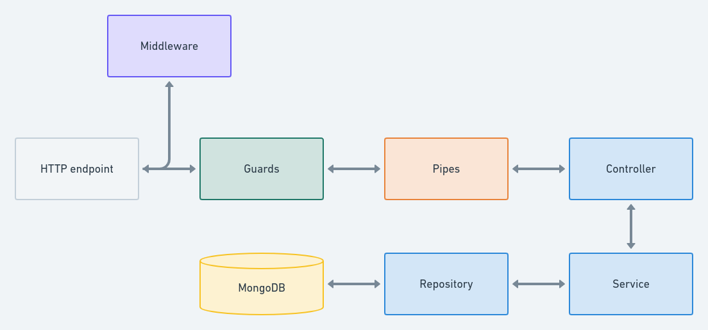
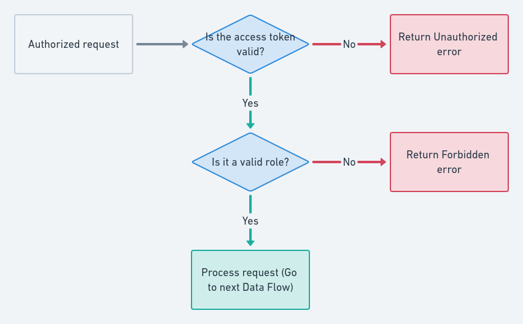

# 🌿 Ecommerce Store Nest and MongoDB

Rest Api NestJS + MongoDB with authentication with jwt and passport. Validation of actions by roles. With self-generated documentation with Swagger.

## Content

This project has one branch: main, contains the final product. And several temporary child branches where features are resolved or bugs are fixed.
Carrying out the git workflow strategy [github flow](https://guides.github.com/introduction/flow/)

## Demo

If you want to see the demo of this proyect deployed, you can visit [Demo of the proyect](https://ecommerce-store-nest-mongo.herokuapp.com/api)

> This is for the sole purpose of having the deployment

## Installation

```sh
# yarn
yarn

# npm
npm install
```

### Running the App

```sh
# development
yarn start

# watch mode
yarn start:dev

# production mode
yarn start:prod
```

### How to start the database container 🐘

```sh
# up in background
docker-compose up -d mongo
```

> Don't forget to fill in the field of `example.env`

## Data Flow



## Access Token and Role Flow


