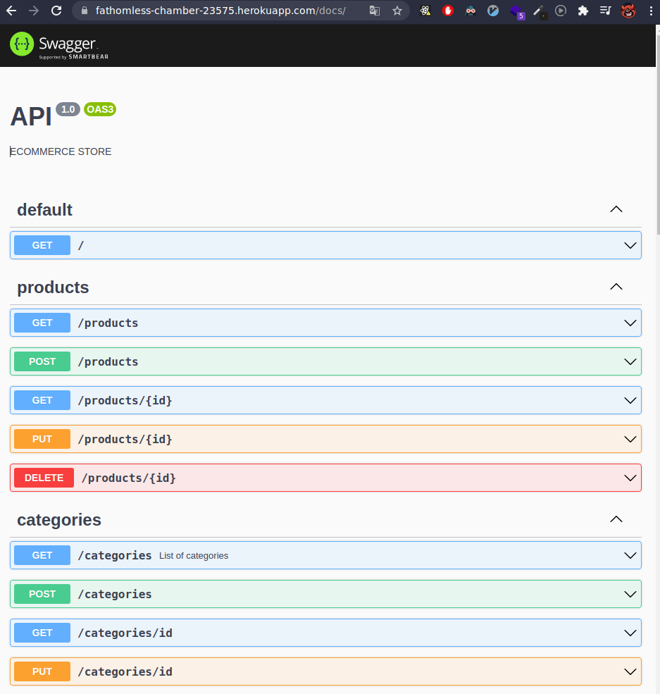

# REST API with NestJS + Moongose + Auth + Swagger

## Why?

- REST APIs are the staple of the web development industry
- Knowing how REST APIs is important for both back and frontend developers
- There's no better way to understand how they work than to build one

## Concepts

- REST API
- JWT and Passport Auth
- Data persistence in MongoDB
- Documentation with OpenAPI

## Technologies

- Node.js
- MongoDB with Mongoose
- Typescript
- NestJS

## Installation

```bash
# yarn
yarn

# npm
npm install
```

## Running the app

```bash
# development
$ npm run start

# watch mode
$ npm run start:dev

# production mode
$ npm run start:prod
```

## Test endpoints

In the request folder, you will find a list of endpoints ready to test in VS Code with the extension [Rest Client](https://marketplace.visualstudio.com/items?itemName=humao.rest-client)

### Endpoints Documentation

- `http://localhost:3000/api/docs`


